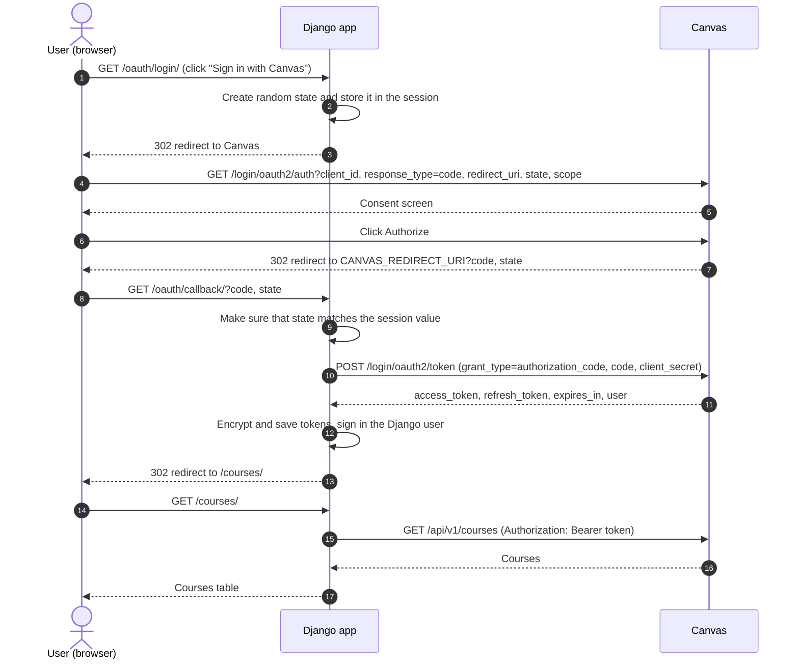

# Canvas Developer Key OAuth demo

This is a small Django app that shows the Canvas LMS Developer Key OAuth2 flow. A Developer Key is an API key that a Canvas admin creates in Canvas. The app uses the OAuth2 authorization code grant to get two tokens for the signed-in Canvas user: a refresh token and an access token. The access token is valid for 1 hour. The refresh token gets a new access token. The app stores both tokens encrypted. When the access token expires, the app refreshes it. Then the app lists the courses the user is enrolled in.

This app is a basic demo. The database is SQLite. For production, use a database such as PostgreSQL and a real secrets store (for example AWS Secrets Manager) for the environment variables.

## How the OAuth flow works

1. The user clicks "Sign in with Canvas" on the home page. The app creates a random `state` value and stores it in the session. The `state` parameter is a random value that stops cross-site request forgery.
2. The app redirects the browser to `GET {CANVAS_BASE_URL}/login/oauth2/auth` with `client_id`, `response_type=code`, `redirect_uri`, `state`, and `scope`.
3. Canvas shows a consent screen. If the user clicks Authorize, Canvas redirects to `CANVAS_REDIRECT_URI` with `code` and `state`. If the user clicks Cancel, Canvas redirects with `error=access_denied`.
4. The app makes sure that the returned `state` matches the value in the session. Then the app sends `POST {CANVAS_BASE_URL}/login/oauth2/token` with `grant_type=authorization_code`, `client_id`, `client_secret`, `redirect_uri`, and `code`.
5. Canvas returns `access_token`, `refresh_token`, `expires_in` (3600 seconds), and the Canvas `user`. The app creates or updates a Django user, encrypts both tokens, saves them, and signs the user in.
6. The app calls `GET {CANVAS_BASE_URL}/api/v1/courses` with the header `Authorization: Bearer <access_token>`. It follows the `Link` header (`rel="next"`) until there are no more pages.
7. If the access token is within 60 seconds of expiry, or if Canvas returns 401, the app sends `POST {CANVAS_BASE_URL}/login/oauth2/token` with `grant_type=refresh_token`. Canvas returns a new access token. The refresh token does not change. The refresh can fail, for example because an admin revoked the key. If it fails, the app deletes the stored tokens and asks the user to sign in again.
8. On logout, the app sends `DELETE {CANVAS_BASE_URL}/login/oauth2/token` with the bearer token. This revokes the token in Canvas. Then the app deletes the token row and ends the Django session.

This sequence diagram shows the successful sign-in path. Each arrow is a request or a response between the browser, the app, and Canvas.



## Security practices

- Tokens are encrypted at rest with Fernet. Fernet is symmetric authenticated encryption. The key comes from `TOKEN_ENCRYPTION_KEY`.
- The Canvas client secret and the Django secret key live only in environment variables. They are never committed. `.env` is in `.gitignore`.
- The `state` parameter is compared in constant time and is removed from the session after one use.
- Session and CSRF cookies are HttpOnly and use `SameSite=Lax`. Outside debug mode the cookies are Secure, HSTS is on, and HTTP requests redirect to HTTPS.
- The app requests the minimal OAuth scope `url:GET|/api/v1/courses`.
- Token values are never logged and never shown in the Django admin.
- The token is revoked at Canvas on logout, and the token row is deleted.
- All requests to Canvas use a 10 second timeout.
- Logout is a POST request with CSRF protection.

## Prerequisites

- Python 3.12
- [uv](https://docs.astral.sh/uv/)
- An account admin role on a Canvas instance. A test or beta instance such as `https://<school>.test.instructure.com` is best. Free-for-Teacher accounts cannot create developer keys.

Canvas allows `http://localhost` redirect URIs for development. You do not need HTTPS on your machine.

## Create the Developer Key in Canvas

The Developer Key must be created by a root-level Canvas admin.  If you do not have this role, ask your Canvas admin to create the key for you.

1. Sign in to Canvas as an account admin.
2. Go to Admin, then Developer Keys.
3. Click "+ Developer Key", then "+ API Key".
4. Enter a Key Name. For example, "Canvas Developer Key Demo".
5. Enter an Owner Email.
6. In Redirect URIs, enter `http://localhost:8000/oauth/callback/`. This value must match `CANVAS_REDIRECT_URI` exactly, including the trailing slash.
7. Turn Enforce Scopes ON and select `url:GET|/api/v1/courses`.
8. Click Save.
9. In the key list, turn the key state to ON.
10. Copy the numeric ID from the Details column. This is `CANVAS_CLIENT_ID`.
11. Click "Show Key" and copy the secret. This is `CANVAS_CLIENT_SECRET`.

## Install and run locally

1. Install the dependencies.

   ```sh
   uv sync
   ```

2. Create your environment file.

   ```sh
   cp .env.example .env
   ```

3. Generate the Fernet key for `TOKEN_ENCRYPTION_KEY`.

   ```sh
   uv run python -c "from cryptography.fernet import Fernet; print(Fernet.generate_key().decode())"
   ```

4. Generate the Django secret for `DJANGO_SECRET_KEY`.

   ```sh
   uv run python -c "from django.core.management.utils import get_random_secret_key; print(get_random_secret_key())"
   ```

5. Open `.env` and fill in every variable.

   | Variable | Value |
   | --- | --- |
   | `DJANGO_SECRET_KEY` | The value from step 4. |
   | `DJANGO_DEBUG` | `true` for local development. |
   | `DJANGO_ALLOWED_HOSTS` | `localhost,127.0.0.1` |
   | `CANVAS_BASE_URL` | Your Canvas URL, for example `https://school.test.instructure.com`. No trailing slash. |
   | `CANVAS_CLIENT_ID` | The numeric developer key ID. |
   | `CANVAS_CLIENT_SECRET` | The developer key secret. |
   | `CANVAS_REDIRECT_URI` | `http://localhost:8000/oauth/callback/` |
   | `CANVAS_SCOPES` | Default is `url:GET|/api/v1/courses`. This value must match the scopes that you selected in the developer key. |
   | `TOKEN_ENCRYPTION_KEY` | The value from step 3. |

6. Create the database.

   ```sh
   uv run manage.py migrate
   ```

7. Start the server.

   ```sh
   uv run manage.py runserver
   ```

8. Open `http://localhost:8000` in a browser.

Set `DJANGO_DEBUG=true` for local development over plain HTTP. When `DJANGO_DEBUG` is `false`, the app forces HTTPS and marks the cookies as Secure. A plain HTTP session on localhost will not work in that mode.

## Manual test plan

1. Open `http://localhost:8000` and click "Sign in with Canvas".
   Expected result: the browser shows the Canvas consent screen.
2. Click Authorize.
   Expected result: the browser lands on `/courses/` and shows a table of your active courses.
3. Sign out. Start the sign in again and click Cancel on the consent screen.
   Expected result: the app shows the error page with status 403.
4. Tamper with the `state` value. Start the sign in and click Authorize. When the browser reaches the callback URL, stop the page load. Edit the `state` query parameter in the callback URL to a different value and load that URL.
   Expected result: the app shows the error page with status 400.
   Alternative: open `http://localhost:8000/oauth/callback/?code=x&state=wrong` in a new private window. The expected result is the same.
5. Force a token refresh. Sign in, then open a Django shell.

   ```sh
   uv run manage.py shell
   ```

   Run these lines.

   ```python
   from datetime import timedelta
   from django.utils import timezone
   from canvas_oauth.models import CanvasToken

   token = CanvasToken.objects.first()
   token.expires_at = timezone.now() - timedelta(hours=1)
   token.save()
   ```

   Reload `http://localhost:8000/courses/`.
   Expected result: the page still loads. In the shell, `CanvasToken.objects.first().expires_at` is now in the future.
6. Make sure that the stored tokens are ciphertext. In the shell, run this line.

   ```python
   CanvasToken.objects.first().encrypted_access_token
   ```

   Expected result: the value starts with `gAAAA` and is not a Canvas token. The plain token is only available through `CanvasToken.objects.first().access_token`.
7. Log out. Before you log out, copy the plain access token from the shell with `CanvasToken.objects.first().access_token`. Then click the logout button on the home page.
   Expected result: `CanvasToken.objects.count()` is `0` in the shell. The old token no longer works at Canvas. This command returns 401.

   ```sh
   curl -i -H "Authorization: Bearer <old token>" $CANVAS_BASE_URL/api/v1/courses
   ```

## Automated tests

Run the tests.

```sh
uv run pytest
```

Format and lint the code.

```sh
uv run ruff format . && uv run ruff check .
```

The tests mock Canvas with the `responses` library. They need no Canvas instance and no network access. The tests use `config/test_settings.py`, which sets fixed test values for every environment variable. You do not need a `.env` file to run the tests.

## Project layout

```
manage.py                      Django command line entry point
config/
  settings.py                  Settings, environment variables, security settings
  test_settings.py             Fixed environment values for the automated tests
  urls.py                      Project URL routes (app routes and admin)
  wsgi.py, asgi.py             Server entry points
canvas_oauth/
  models.py                    CanvasToken model with encrypted token fields
  crypto.py                    Fernet encrypt and decrypt helpers
  canvas.py                    Canvas OAuth calls and API client with refresh and pagination
  views.py                     Home, login, callback, courses, and logout views
  urls.py                      App URL routes
  admin.py                     Admin registration (token values hidden)
  migrations/                  Database migrations
  templates/canvas_oauth/      base.html, home.html, courses.html, error.html
tests/
  conftest.py                  Shared pytest fixtures
  test_crypto.py               Tests for encrypt and decrypt
  test_models.py               Tests for CanvasToken
  test_canvas.py               Tests for the Canvas client (mocked with responses)
  test_views.py                Tests for the views and the OAuth flow
.env.example                   Template for the environment variables
pyproject.toml                 Project metadata, dependencies, pytest and ruff settings
```

## Links

- Canvas OAuth2 overview: https://canvas.instructure.com/doc/api/file.oauth.html
- Canvas OAuth2 endpoints: https://canvas.instructure.com/doc/api/file.oauth_endpoints.html
- Canvas developer keys: https://canvas.instructure.com/doc/api/file.developer_keys.html
- Canvas courses API: https://canvas.instructure.com/doc/api/courses.html
- Canvas API pagination: https://canvas.instructure.com/doc/api/file.pagination.html
